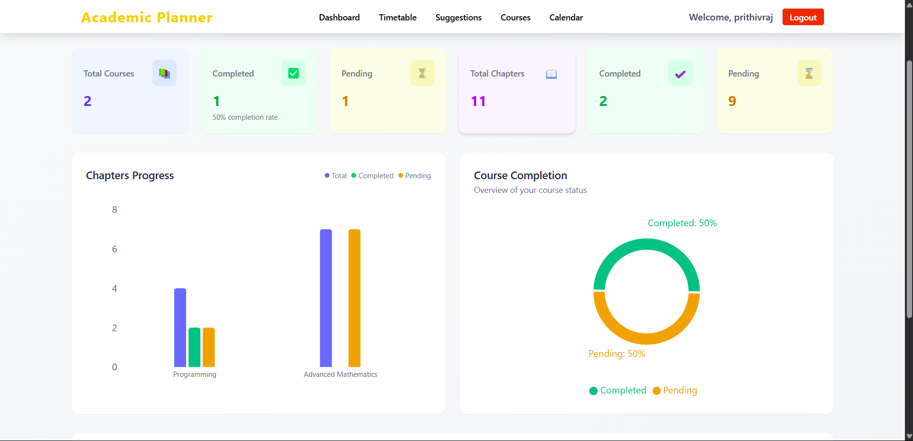
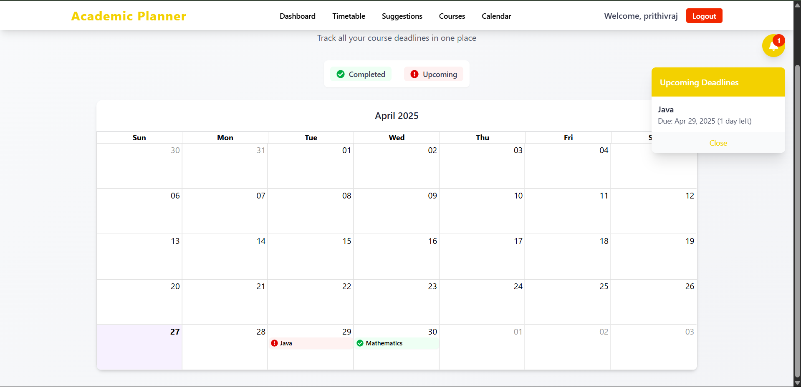
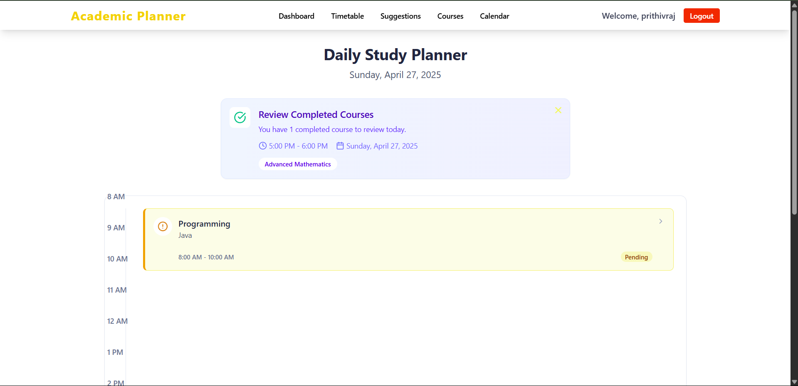
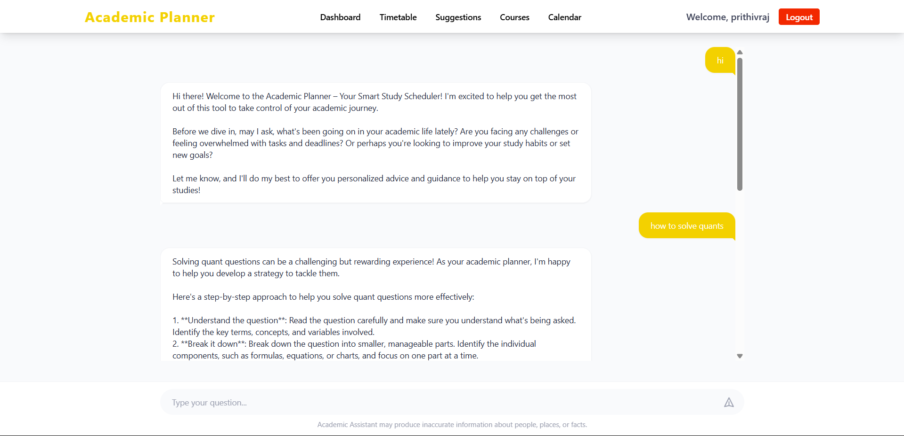
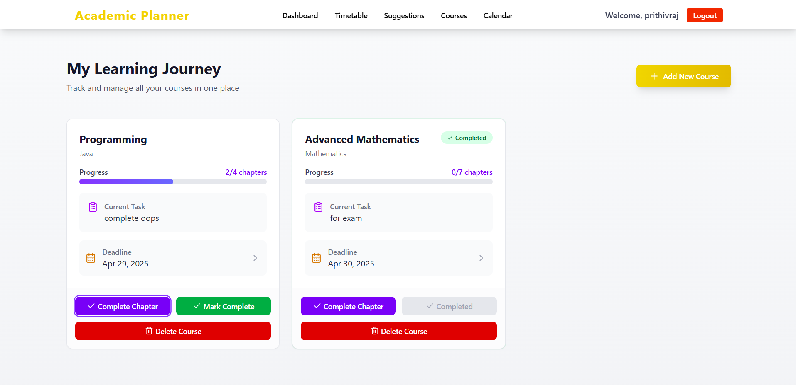

# 🌟 Academic Planner

**Academic Planner** is a comprehensive platform designed to help students manage their academic tasks, schedules, and important deadlines effectively. It provides a smooth experience with features like task creation, management, planning, and secure authentication using **JWT (JSON Web Tokens)**.

---

## 🚀 Features

1. **🗓️ Task Management**  
   Create, update, and organize your academic tasks and deadlines easily.

2. **📋 Daily and Weekly Planners**  
   Visualize your tasks on daily and weekly views for better planning.

3. **✅ Mark Task Completion**  
   Stay on top of your progress by marking tasks as completed.

4. **🔍 Search and Filter Tasks**  
   Easily search and filter tasks by date, subject, or status.

5. **🛡️ Secure User Authentication (JWT)**  
   User authentication and protected routes are securely handled using **JWT**.

6. **💬 Interactive UI**  
   A clean, responsive, and intuitive user interface built with React and TailwindCSS.

7. **🌐 Python Microservice**  
   Backend services like analytics or notifications are handled separately using a Python server.

---

## 🌐 Live Link

👉 [Live Website - Academic Planner](https://studyacademicplanner.netlify.app/)

---

## 🌐 Explore the UI/UX wireframes, prototypes, and design system:

👉 [Figma link](https://www.figma.com/proto/7BN21Yq3r0fjZHZQ8KjGgu/Academic-Planner?node-id=1-2&p=f&t=V91rTyxyRpfFg0TP-1&scaling=min-zoom&content-scaling=fixed&page-id=0%3A1&starting-point-node-id=1%3A2&show-proto-sidebar=1)

---

## 🛠️ Getting Started

### ⚙️ Prerequisites

Make sure you have the following installed:

- **Node.js**: For backend and frontend.
- **Python 3**: For running the Python server.
- **Vite**: For a fast frontend development experience.
- **Virtual Environment**: To manage Python dependencies.

---

## 📥 Installation

Follow these steps to set up the project locally:

1. Clone the repository:

   ```bash
   git clone https://github.com/PRAVEEN-PR-2004/Academic_planner_project
   ```

2. Navigate into the project directory:

   ```bash
   cd Academic_planner_project
   ```

3. **Set up Frontend (academic_planner):**

   ```bash
   cd academic_planner
   npm install
   npm run dev
   ```

4. **Set up Node.js Backend (backend):**

   ```bash
   cd backend
   npm install
   node index.js
   ```

5. **Set up Python Server (pythonserver):**

   ```bash
   cd pythonserver
   python -m venv venv
   source venv/bin/activate  # (On Windows: venv\Scripts\activate)
   pip install -r requirements.txt
   python app.py
   ```

---

## 🗂️ Project Structure

```bash
Academic_Planner
│
├── academic_planner        # Frontend (React + Vite + TailwindCSS)
│   ├── public
│   ├── src
│   │   ├── assets
│   │   ├── components
│   │   ├── pages
│   │   └── main.jsx
│   └── index.html

│
├── backend                 # Backend (Node.js + Express + JWT)
│   ├── config
│   ├── controllers
│   ├── middleware
│   ├── model
│   ├── routes
│   └── index.js
│
└── pythonserver            # Python Server (Microservices / APIs)
    ├── app.py
    └── .env
```

---

## 🖥️ Screenshots

### 🏠 Home Page


### 📊 Dashboard



### 📅 Calendar



### 🗓️ Timetable



### 💡 Suggestion Page



### 📚 Course Page



---

## 🔥 Conclusion

**Academic Planner with AI** offers a smart, intuitive, and efficient way for students to manage their academic life — powered by modern web technologies and cutting-edge AI!

---

## 📞 Contact

For any inquiries or feedback, feel free to reach out:

- **Name**: Praveen
- **Email**: [praveen2004ttp@gmail.com](mailto:praveen2004ttp@gmail.com)
- **GitHub**: [PRAVEEN-PR-2004](https://github.com/PRAVEEN-PR-2004)
- **Portfolio**: [Praveen's Portfolio](https://main--praveen-portfolio2.netlify.app/)
